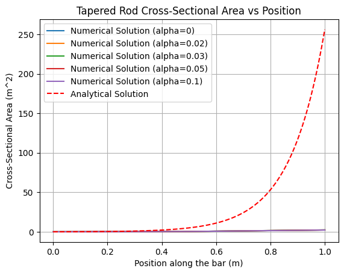
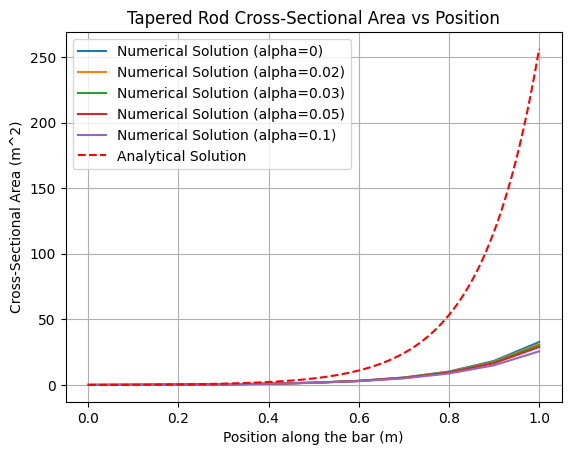
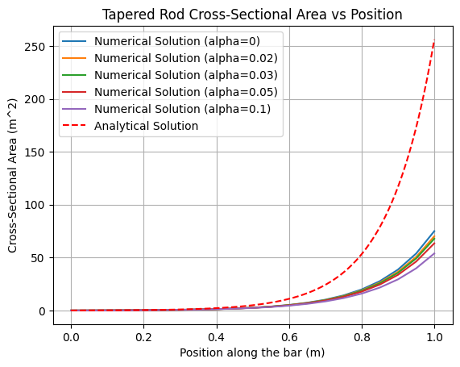
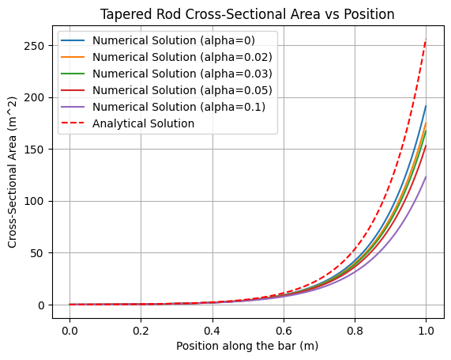
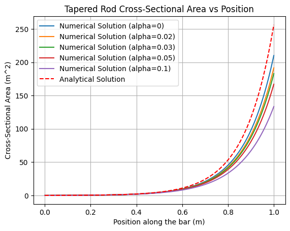
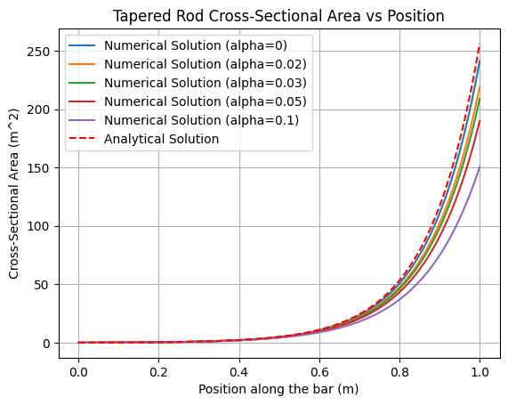
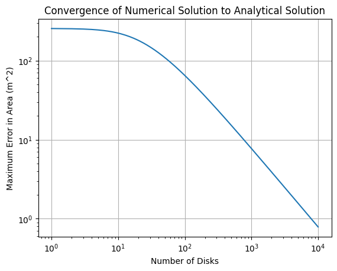
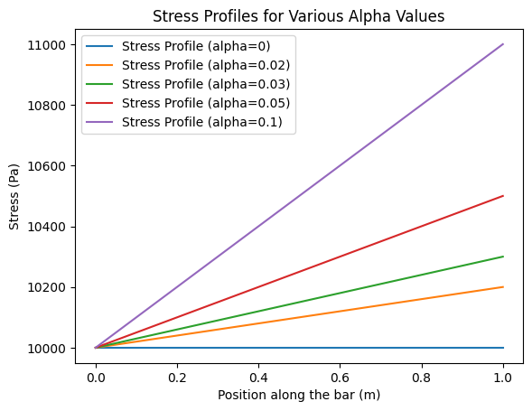

# Final Exam Technical Report

## ENGR 492 - Finite Element Methods

**Author: Andre Cox**

**Student Number: 95076758**

## Problem Statement

For this final exam, we are tasked with determining the shape of a vertical bar that will experience a uniform axial stress as well as the shape that will cause stress that increases by a certain percentage along its length.

## Assumptions

- We assume that the bar is mounted vertically and is subject to its own weight.

- The material of the bar is uniform with no change of properties along its length.

- The bar does not experience any deformation.

## Governing Equations

We define $x=0$ as the bottom of the bar, and $x=L$ as the top of the bar.

The axial stress can be defined as
$$\sigma(x) = \frac{P(x)}{A(x)}$$

where $P(x)$ is the axial force at position $x$ and $A(x)$ is the cross-sectional area at position $x$.

The axial force at position $x$ is given by
$$P(x) = P_{applied} + \rho g \int_{x}^{L} A(x) dx$$
where $P_{applied}$ is the applied force at the top of the bar, $\rho$ is the density of the material, and $g$ is the acceleration due to gravity.

## Derivation of A(x)

We determine $A(x)$ which is the cross-sectional area at position $x$ along the bar. To derive this equation, we use the derivation covered in Lecture 3. This assumes that the stress remains constant so we use the force balance equation:

$\sigma_0A+\rho gAdx=\sigma(A+dA)$

This is then rearranged to get

$\frac{dA(x)}{A(x)}=\frac{\rho g}{\sigma_0}dx$

This is then integrated to get the final equation:
$A(x)=A_0exp(\frac{\rho g x}{\sigma_0})$

Where $A_0$ is the area at the bottom of the bar.

## Numerical method and disk formulation

To solve the problem numerically, we discretize the bar into a series of disks. The steps are as follows:

1. Compute the weight of the first disk element at the bottom using initial width and dx where dx = length / number of disks
2. Compute the stress at the bottom using applied force and area, we save this as our reference stress
3. Use the weight of the first disk to add to the applied force to get the total force at the next disk
4. compute the area at the next disk to keep the stress the same as the reference stress we do this using A = P / stress
5. Continue the process up the bar length

Code implementation of the above method is as follows:

```py
def compute_tapered_rod(P_applied_force, p_density, g_gravity, w0_initial_width, t0_initial_thickness, L_length, sections, alpha):
    dx = L_length / sections # length of each section
    x_positions = np.linspace(0, L_length, sections + 1) # Positions along the rod

    force = P_applied_force # initial force at the bottom
    # Lists created to store weights and areas of each section
    disk_weights = []
    areas = []

    # Step 1. Setup the initial conditions for the bottom of the rod
    areas.append(w0_initial_width * t0_initial_thickness) # area at bottom
    # Step 2. Compute the reference stress at the bottom
    reference_stress = stress_from_area(force, areas[-1]) # initial stress at bottom
    disk_weights.append(0)  # No weight at the bottom

    for i in range(1, sections + 1):
        # Step 3. Compute weight of previous disk
        disk_weight = p_density * g_gravity * areas[-1] * dx
        disk_weights.append(disk_weight) # disk weight from x_position[i-1] to x_position[i]

        # Update force on current area
        force += disk_weight # force increases over rod length so we add

        # Step 4. Compute the area needed to maintain the reference stress
        area = force / reference_stress # compute area at position i
        areas.append(area) # store area at position i

        reference_stress *= (1 + alpha * dx)  # increase reference stress linearly

        # Step 5. Continue to next section
    return x_positions, areas, disk_weights
```

## Results for all disk counts

| Disks     | Area vs Position                                      |
| --------- | ----------------------------------------------------- |
| 2 Disks   |      |
| 10 Disks  |    |
| 20 Disks  |    |
| 100 Disks |  |
| 150 Disks |  |
| 500 Disks |  |

## Verification of the Lecture 3 case

In Lecture 3 the case for our bar (square cross section) was derived as follows:
$$A(x) = A_0 e^{\frac{y_0t\rho gx}{\sigma_0}}$$
To verfify this in our code we increase the amount of disks we use and check to see if the numerical solution converges to the analytical solution.



We determine the error between the numerical and analytical solutions using the following code:

```py
    error = np.abs(np.array(areas) - analytical_areas)
    max_error = np.max(error)
```

As we can see from the plot the error approaches zero as we increase the number of disks used in the numerical solution. This shows that our numerical solution is converging to the analytical solution derived in Lecture 3.

## Discussion

Using the finite element method to discretize the bar into disks allows us to solve the problem in a simple manner. Since we are able to compute the area based off of the force and desired stress at the position we can adjust the area to maintain the stress profile we want. In fact with this method we could create any stress profile we want by feeding in a function that describes how we want the stress to change along the length of the bar. One potential limitation is that for more precision we need to increase the number of disks which increases the computational cost. We were also asked to confirm the following:

- whether the stress remains uniform (or matches the assigned percentage increase)

Below you will find the stress profiles and you can see that they match the expected behavior.


- whether equilibrium is satisfied

Since we can see that our numerical solution converges to the analytical solution derived in Lecture 3 we confirm that the equilibrium is satisfied.

- whether the solutions converge as the number of disks increases.

As shown above in the section [Verification of the Lecture 3 case](#Verification-of-the-Lecture-3-case) we see that the error approaches zero as we increase the number of disks used in the numerical solution.

Further we get the error for a couple of very high disk counts:

| Disks         | Max Error           |
| ------------- | ------------------- |
| 1000 Disks    | 7.725575666799756   |
| 10000 Disks   | 0.7869293485487674  |
| 100000 Disks  | 0.07883907115657962 |
| 1000000 Disks | 0.00788537096860864 |

We see that as we increase the number of disks the error approaches zero.

## Conclusion

To conclude we have taken the analytical solution to maintain a uniform stress profile along a vertical bar under its own weight. From this we then created a numerical method and verified that it produces results that converge to the analytical solution as we increase the amount of steps used. This method can be extended to create any stress profile for instance a linearly increasing stress profile as shown in the code above.
